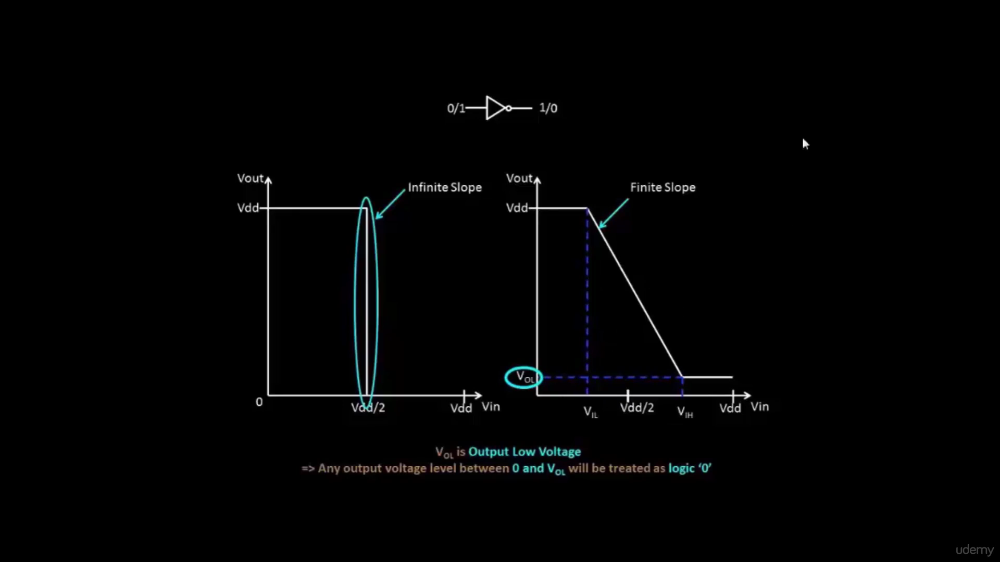
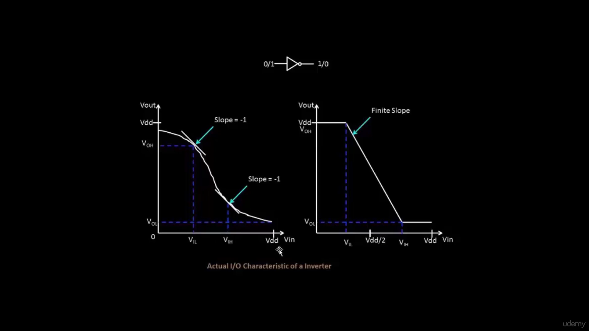
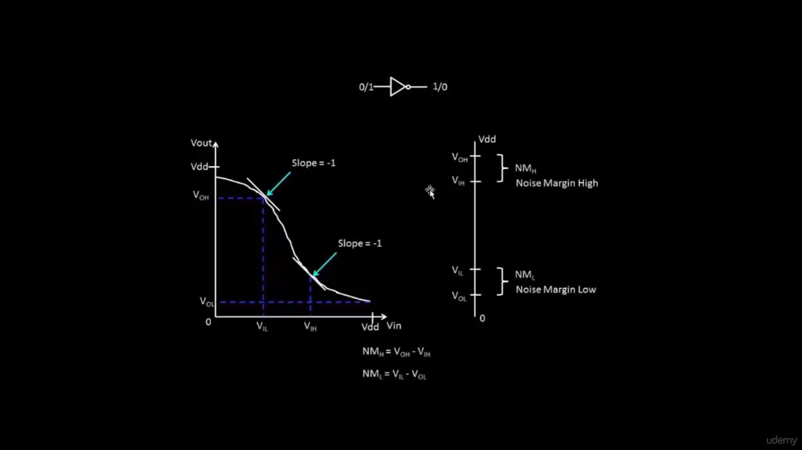
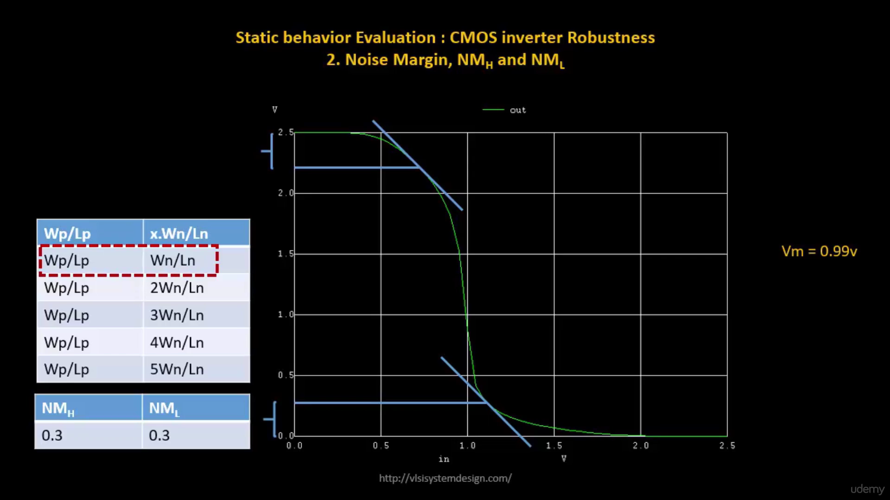
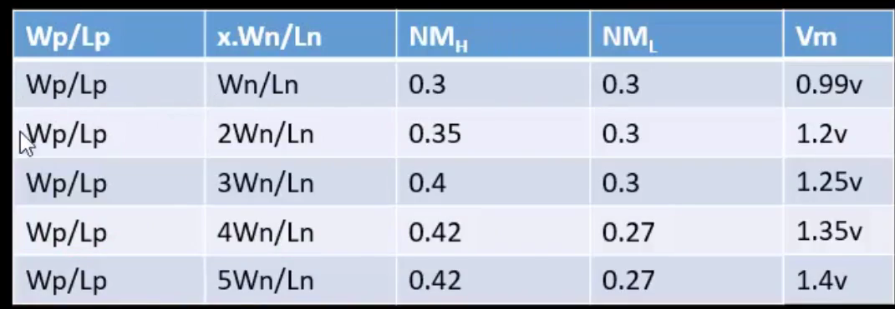
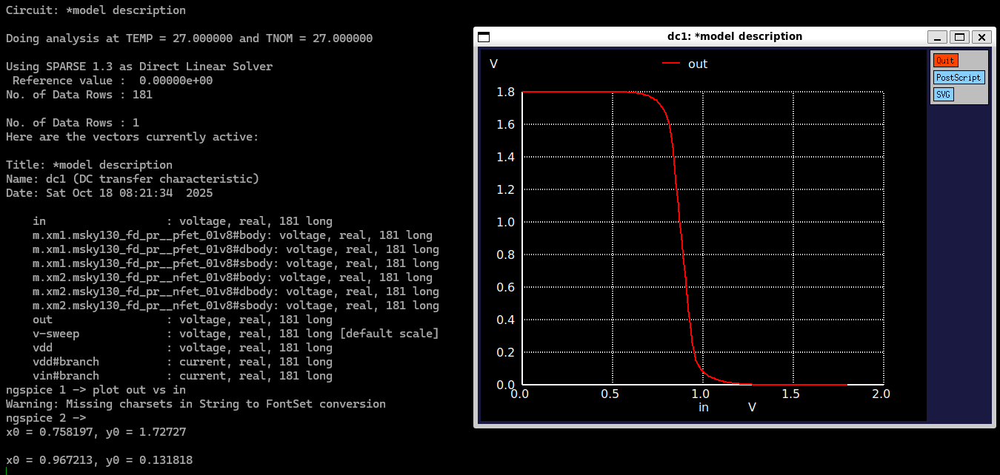

# NgspiceSky130 - Day 4 - CMOS Noise Margin robustness evaluation

## Static behavior evaluation – CMOS inverter robustness – Noise margin

### L1: Introduction to noise margin

ideally slope = infinte
reality slope = finite


---

### L2: Noise margin voltage parameters



0 < Vil < Vol < Vih < Voh

---

### L3: Noise margin equation and summary

Noise margin High = Voh - Vih

Noise margin Low = Vil - Vol




---

### L4: Noise margin variation with respect to PMOS width





---

### L5: Sky130 Noise margin labs



```ngspice
x0 = 0.758197, y0 = 1.72727

x0 = 0.967213, y0 = 0.131818
```

Voh = 1.72727
Vil = 0.758197

Vol = 0.131818
Vih = 0.967213

NMh = 1.72727 - 0.967213 = 0.760057
NMl = 0.758197 - 0.131818 = 0.626379

---
