# NgspiceSky130 - Day 5 - CMOS power supply and device variation robustness evaluation

## Static behavior evaluation – CMOS inverter robustness – Power supply variation

### L1: Smart SPICE simulation for power supply variations

pmos> nmos  
cmos behaviour should not change on sweeping Vdd from 2.5 to 1 V in steps of 0.5V  

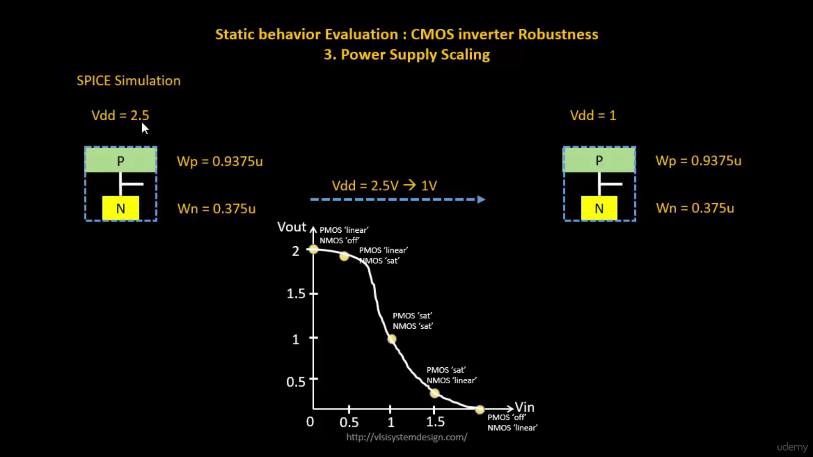

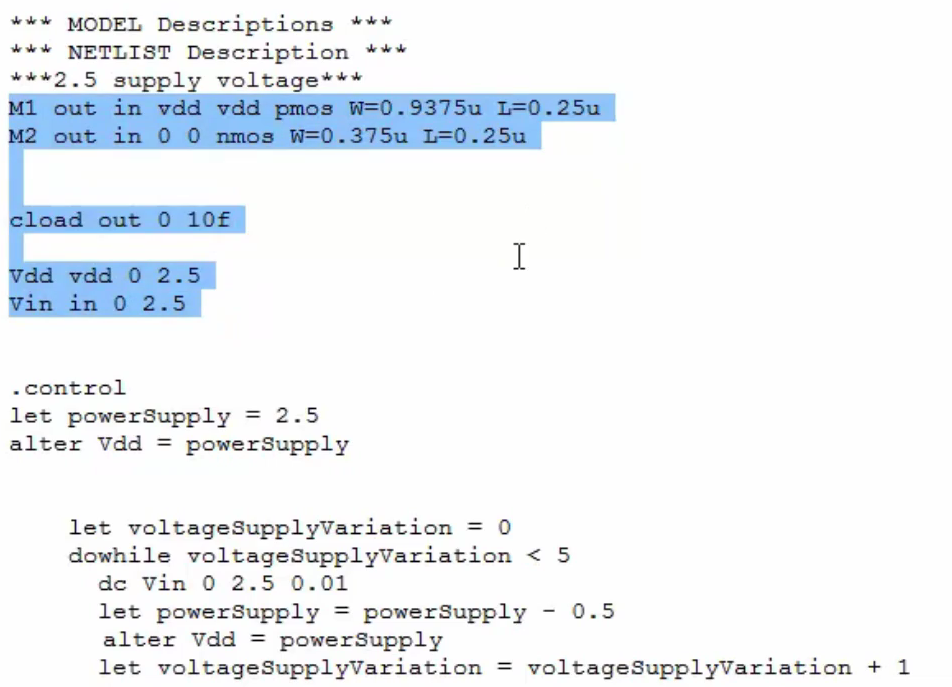
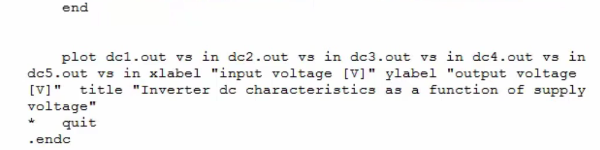
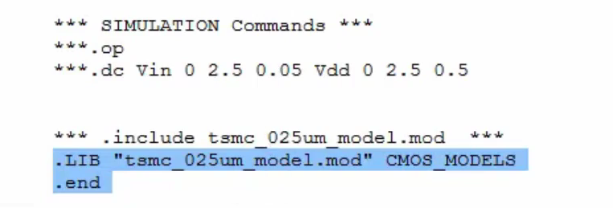

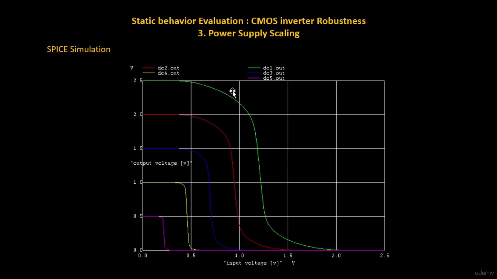

---

### L2: Advantages and disadvantages using low supply voltage

gain = change in o/p V   /    change in Vi/p    

gain2.5 = 7.3 

gain0.5 = 11.53 // 50% improvement in gain

E = 1/2 C V^2

but rise and fall delay are so high for 0.5V that it might not even reach on time.

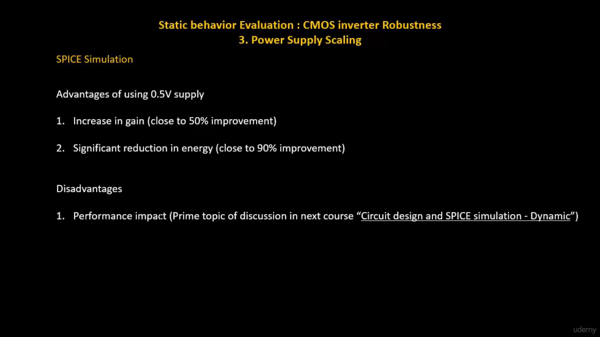

---

### L3: Sky130 Supply Variation Labs

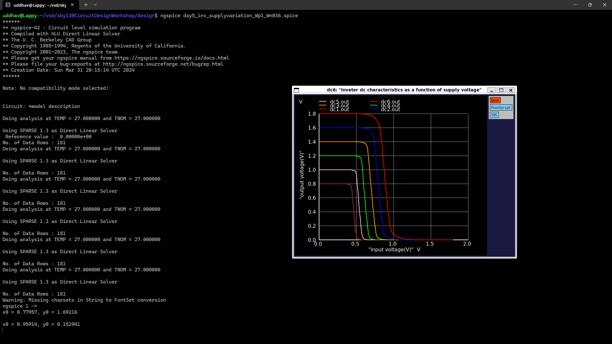

```ngspice
x0 = 0.77957, y0 = 1.69216

x0 = 0.95914, y0 = 0.152941

x0 = 0.701075, y0 = 1.53922

x0 = 0.876344, y0 = 0.0745098

x0 = 0.633333, y0 = 1.35882

x0 = 0.770968, y0 = 0.0588235

x0 = 0.553763, y0 = 1.17451

x0 = 0.668817, y0 = 0.054902

x0 = 0.491398, y0 = 0.970588

x0 = 0.58172, y0 = 0.045098

x0 = 0.421505, y0 = 0.780392

x0 = 0.5, y0 = 0.045098
```

#### now calculating gain

1. **1.8V**: 
    - Points: (0.77957, 1.69216) and (0.95914, 0.152941)
    - Gain = (0.152941 - 1.69216) / (0.95914 - 0.77957)
    - Gain = 1.539219 / 0.17957
    - **Gain = 8.57**

2. **1.6V**: 
    - Points: (0.701075, 1.53922) and (0.876344, 0.0745098)
    - Gain = (0.0745098 - 1.53922) / (0.876344 - 0.701075)
    - Gain = 1.4647102 / 0.175269
    - **Gain = 8.36**

3. **1.4V**: 
    - Points: (0.633333, 1.35882) and (0.770968, 0.0588235)
    - Gain = (0.0588235 - 1.35882) / (0.770968 - 0.633333)
    - Gain = 1.2999965 / 0.137635
    - **Gain = 9.45**

4. **1.2V**: 
    - Points: (0.553763, 1.17451) and (0.668817, 0.054902)
    - Gain = (0.054902 - 1.17451) / (0.668817 - 0.553763)
    - Gain = 1.119608 / 0.115054
    - **Gain = 9.73**

5. **1.0V**: 
    - Points: (0.491398, 0.970588) and (0.58172, 0.045098)
    - Gain = (0.045098 - 0.970588) / (0.58172 - 0.491398)
    - Gain = 0.92549 / 0.090322
    - **Gain = 10.25**

6. **0.8V**: 
    - Points: (0.421505, 0.780392) and (0.5, 0.045098)
    - Gain = (0.045098 - 0.780392) / (0.5 - 0.421505)
    - Gain = 0.735294 / 0.078495
    - **Gain = 9.37**

---

## Static behavior evaluation – CMOS inverter robustness – Device variation

### L1: Sources of variation – Etching process

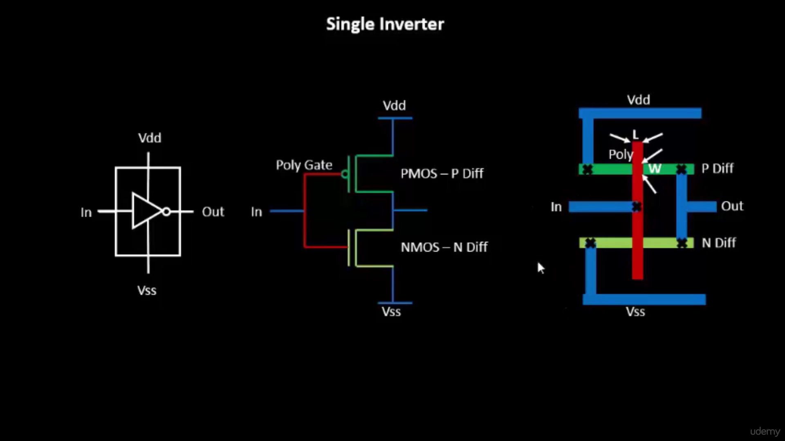

#### chain of inverters

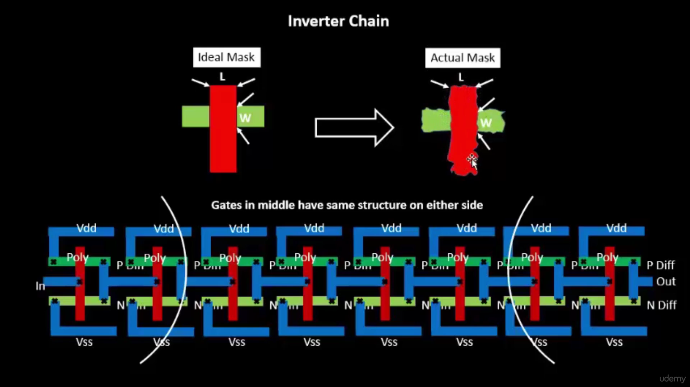

gates in middle have similar structure.     
on the sides the shape might be diff.   

---

### L2: Sources of variation – oxide thickness

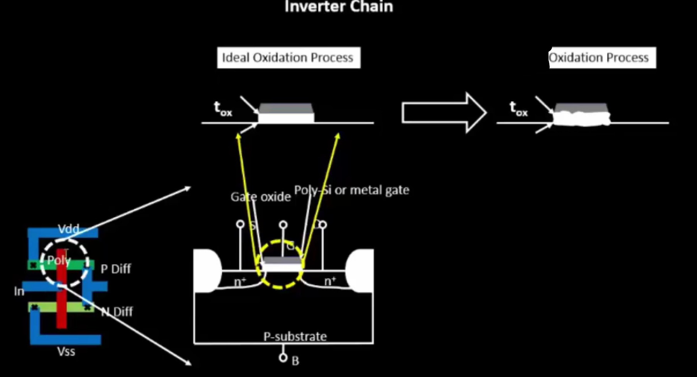

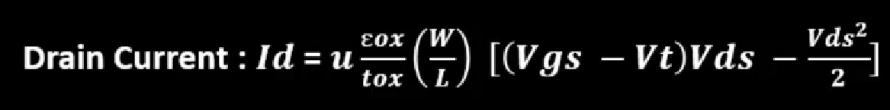

---

### L3: Smart SPICE simulation for device variations

strong pmos -> high w -> low resistance     

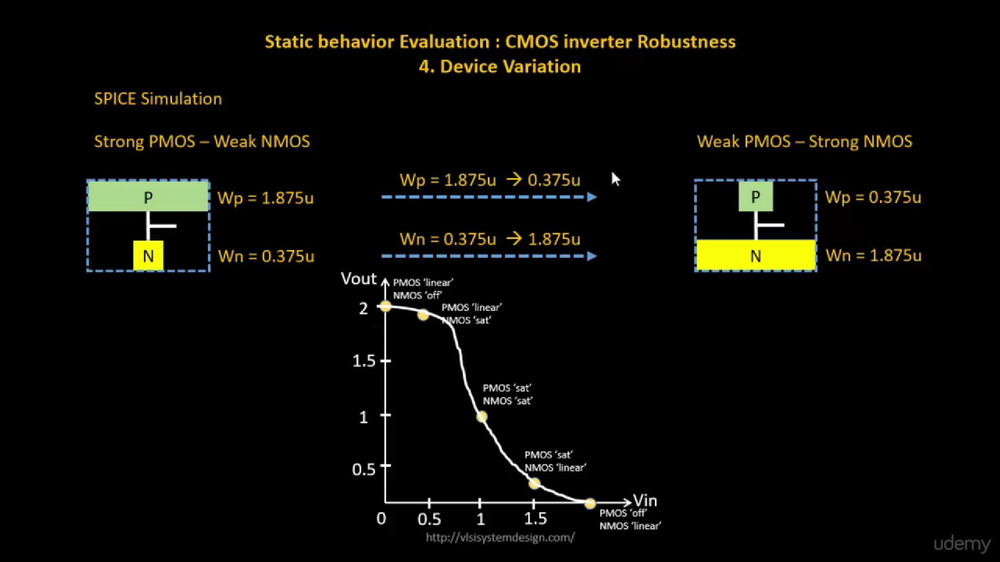

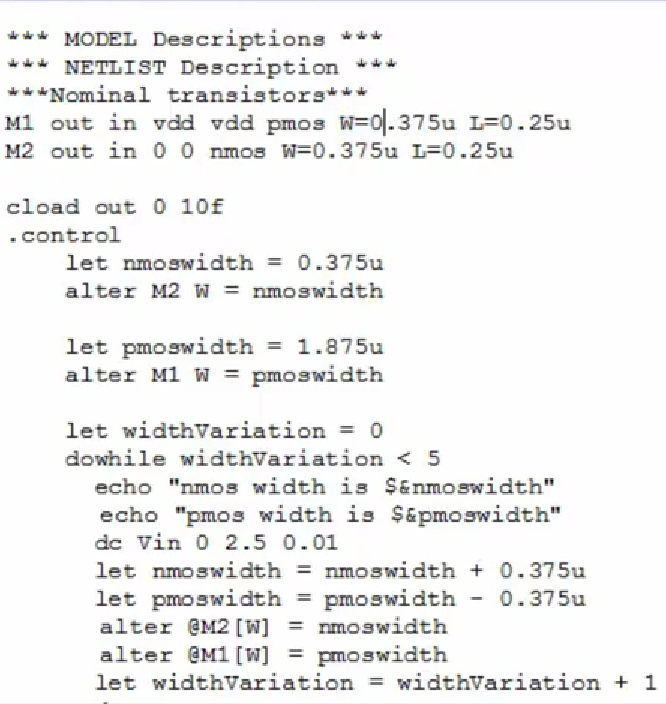
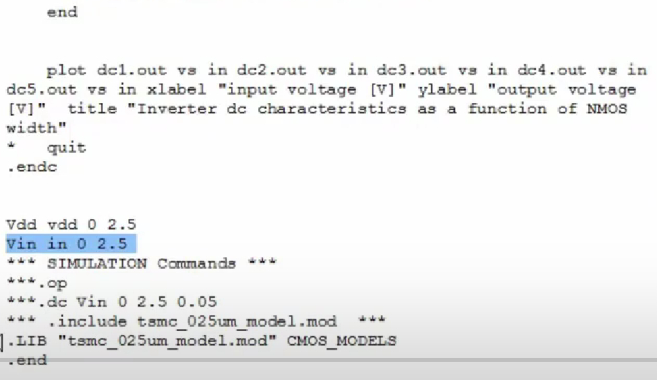

---

### L4: Conclusion

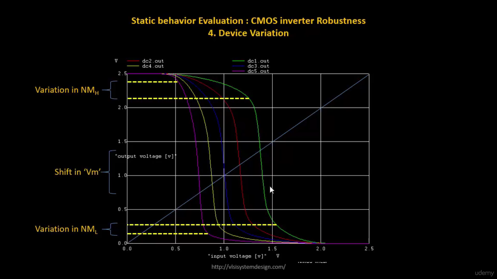

---

### L5: Sky130 Device Variation Labs

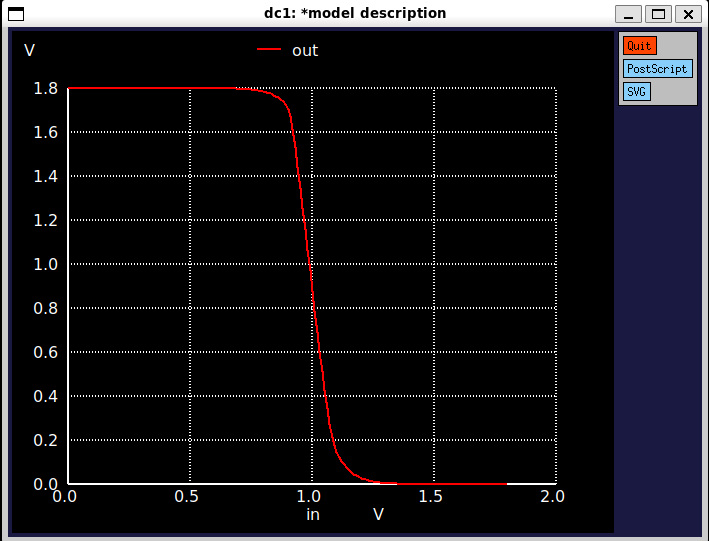

```ngspice
x0 = 0.988208, y0 = 0.988207
```

Vm = 0.988207V

---
