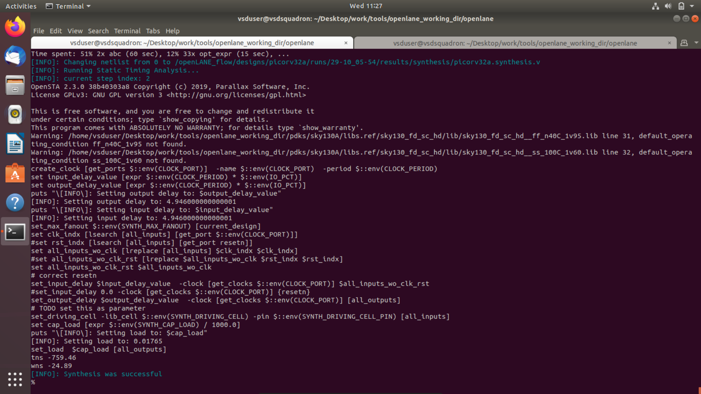

# Sky130 Day 1 - Inception of open-source EDA, OpenLANE and Sky130 PDK

## Overview
This day covers the fundamentals of open-source EDA tools, introduction to OpenLANE flow, and Sky130 PDK basics.

---

## Section 1: How to talk to computers

### 2. Introduction to QFN-48 Package, chip, pads, core, die and IPs

.jpg) 

.jpg) 

---

### 4. From Software Applications to Hardware

.jpg) 

.jpg)

---

## Section 2: SoC design and OpenLANE

### 5. Introduction to all components of open-source digital asic design


.jpg) 
.jpg) 

.jpg) 

.jpg) 

.jpg) 


.jpg) 

.jpg) 

---

### 6. Simplified RTL2GDS flow

.jpg) 

.jpg) 

.jpg) 

.jpg) 

.jpg) 
.jpg) 

.jpg) 

.jpg) 
.jpg) 

.jpg) 

.jpg)

---

### 7. Introduction to OpenLANE and Strive chipsets

.jpg) 

.jpg) 

.jpg) 

.jpg) 

.jpg)

---

### 8. Introduction to OpenLANE detailed ASIC design flow

.jpg) 

.jpg) 

.jpg) 

.jpg) 

.jpg) 

.jpg) 

.jpg) 

.jpg) 

.jpg) 

.jpg) 

.jpg) 

.jpg) 

.jpg)
---

## Section 3: Get familiar to open-source EDA tools

### 9. OpenLANE Directory structure in detail

```bash
cd Desktop/work/tools/openlane_working_dir/openlane
docker
```

---

### 10. Design Preparation Step


```openlane
./flow.tcl -interactive 
prep -design picorv32a
```

---

### 11. Review files after design prep and run synthesis



---

### 12. OpenLANE Project Git Link Description

**Links:**
- efabless/openlane
- https://github.com/efabless/openlane2
- https://github.com/efabless/OpenLane

.jpg)

or just

./flow.tcl -design spm

**Must watch**


---

### 13. Steps to characterize synthesis results

```openlane

```


```
28. Printing statistics.

=== picorv32a ===

   Number of wires:              14596
   Number of wire bits:          14978
   Number of public wires:        1565
   Number of public wire bits:    1947
   Number of memories:               0
   Number of memory bits:            0
   Number of processes:              0
   Number of cells:              14876
     sky130_fd_sc_hd__a2111o_2       1
     sky130_fd_sc_hd__a211o_2       35
     sky130_fd_sc_hd__a211oi_2      60
     sky130_fd_sc_hd__a21bo_2      149
     sky130_fd_sc_hd__a21boi_2       8
     sky130_fd_sc_hd__a21o_2        57
     sky130_fd_sc_hd__a21oi_2      244
     sky130_fd_sc_hd__a221o_2       86
     sky130_fd_sc_hd__a22o_2      1013
     sky130_fd_sc_hd__a2bb2o_2    1748
     sky130_fd_sc_hd__a2bb2oi_2     81
     sky130_fd_sc_hd__a311o_2        2
     sky130_fd_sc_hd__a31o_2        49
     sky130_fd_sc_hd__a31oi_2        7
     sky130_fd_sc_hd__a32o_2        46
     sky130_fd_sc_hd__a41o_2         1
     sky130_fd_sc_hd__and2_2       157
     sky130_fd_sc_hd__and3_2        58
     sky130_fd_sc_hd__and4_2       345
     sky130_fd_sc_hd__and4b_2        1
     sky130_fd_sc_hd__buf_1       1656
     sky130_fd_sc_hd__buf_2          8
     sky130_fd_sc_hd__conb_1        42
     sky130_fd_sc_hd__dfxtp_2     1613
     sky130_fd_sc_hd__inv_2       1615
     sky130_fd_sc_hd__mux2_1      1224
     sky130_fd_sc_hd__mux2_2         2
     sky130_fd_sc_hd__mux4_1       221
     sky130_fd_sc_hd__nand2_2       78
     sky130_fd_sc_hd__nor2_2       524
     sky130_fd_sc_hd__nor2b_2        1
     sky130_fd_sc_hd__nor3_2        42
     sky130_fd_sc_hd__nor4_2         1
     sky130_fd_sc_hd__o2111a_2       2
     sky130_fd_sc_hd__o211a_2       69
     sky130_fd_sc_hd__o211ai_2       6
     sky130_fd_sc_hd__o21a_2        54
     sky130_fd_sc_hd__o21ai_2      141
     sky130_fd_sc_hd__o21ba_2      209
     sky130_fd_sc_hd__o21bai_2       1
     sky130_fd_sc_hd__o221a_2      204
     sky130_fd_sc_hd__o221ai_2       7
     sky130_fd_sc_hd__o22a_2      1312
     sky130_fd_sc_hd__o22ai_2       59
     sky130_fd_sc_hd__o2bb2a_2     119
     sky130_fd_sc_hd__o2bb2ai_2     92
     sky130_fd_sc_hd__o311a_2        8
     sky130_fd_sc_hd__o31a_2        19
     sky130_fd_sc_hd__o31ai_2        1
     sky130_fd_sc_hd__o32a_2       109
     sky130_fd_sc_hd__o41a_2         2
     sky130_fd_sc_hd__or2_2       1088
     sky130_fd_sc_hd__or2b_2        25
     sky130_fd_sc_hd__or3_2         68
     sky130_fd_sc_hd__or3b_2         5
     sky130_fd_sc_hd__or4_2         93
     sky130_fd_sc_hd__or4b_2         6
     sky130_fd_sc_hd__or4bb_2        2

   Chip area for module '\picorv32a': 147712.918400
```

### 14. Inside Virtual Disk

