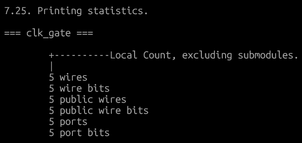

# Lab Step By Step guide

## 1. Setup and Prepare Project Directory

As per the instructions, setting up the directories on your own is not required,    
still heres the structure will look like after 2.1 is done.


## 2. Module Descriptions

### 2.1 VSDBabySoC 

#### 2.1.1 modeling walkthrough

our aim here is to increase/decrease the digital output value and feed it to the DAC model so we can watch the changes on the SoC output.

clone [VSDBabySoC](https://github.com/manili/VSDBabySoC.git) using this script 

```bash
# not needed if already installed these
sudo apt install make python python3 python3-pip git iverilog gtkwave docker.io
sudo chmod 666 /var/run/docker.sock
```

```bash
git clone https://github.com/manili/VSDBabySoC.git
cd VSDBabySoC
python3 -m venv venv
source venv/bin/activate
pip3 install pyyaml click sandpiper-saas
make pre_synth_sim
gtkwave output/pre_synth_sim/pre_synth_sim.vcd
```


in this image

1. Clk: input clk of the RVMYTH core, comes from the PLL.
2. reset: input reset of RVMYTH CORE, comes from external source.
3. OUT:  output OUT signal of the VSDBabySoC module. comes from the DAC {shows up as digital on my }
4. RV_TO_DAC \[9:0\]:  10-bit output \[9:0\] OUT port of the RVMYTH core. This port comes from the RVMYTH register #17
5. OUT: This is a real datatype wire which can simulate analog values. It is the output wire real OUT signal of the DAC module. This signal comes from the DAC

now on right clicking on OUT, converted it to analog signal, interpolated


### 2.1.2 OpenLANE

automated RTL to GDSII flow

You can install using this:
The OpenLANE and sky130 installation can be done by following the steps in this repository <https://github.com/nickson-jose/openlane_build_script>.

i wont be since i have already installed this earlier using this, <https://github.com/AnoushkaTripathi/Openlane_Installation_guide>.

use either i havent tried 1st one.

#### How to Synthesize the Design

To synthesize the VSDBabySoC design, follow these steps:

```bash
cd ~/vsd/VSDBabySoC
make synth
```

result in the output/synth/vsdbabysoc.synth.v file.


#### Post-synthesis simulation (GLS)

```bash
make post_synth_sim
gtkwave output/post_synth_sim/post_synth_sim.vcd
```


different OUT from dac, uut, and tb.    
added hieght for better clarity.    

1. \core.CLK: input CLK signal of the RVMYTH core. This signal comes from the PLL, originally.
2. reset: input reset signal of the RVMYTH core. This signal comes from an external source, originally.
3. OUT:  output OUT signal of the VSDBabySoC module. This signal comes from the DAC (due to simulation restrictions it behaves like a digital signal which is incorrect), originally.
4. \core.OUT[9:0]:  10-bit output [9:0] OUT port of the RVMYTH core. This port comes from the RVMYTH register #17, originally.
5. OUT: This is a real datatype wire which can simulate analog values. It is the output wire real OUT signal of the DAC module. This signal comes from the DAC, originally.
