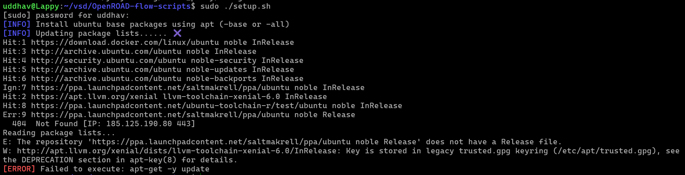
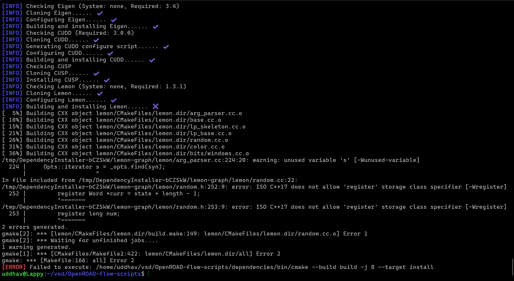
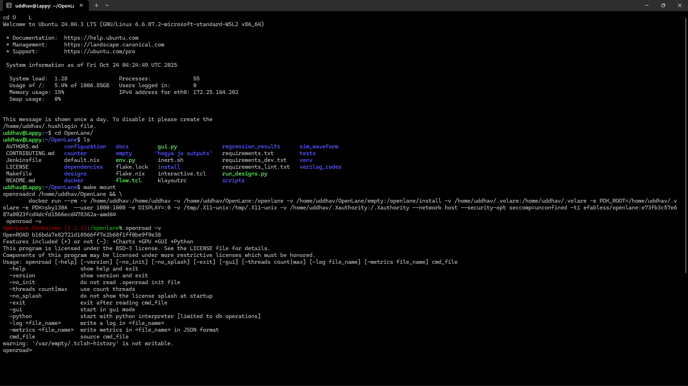
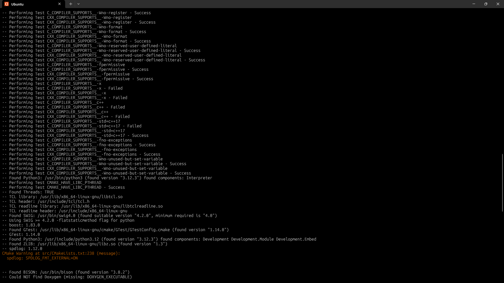
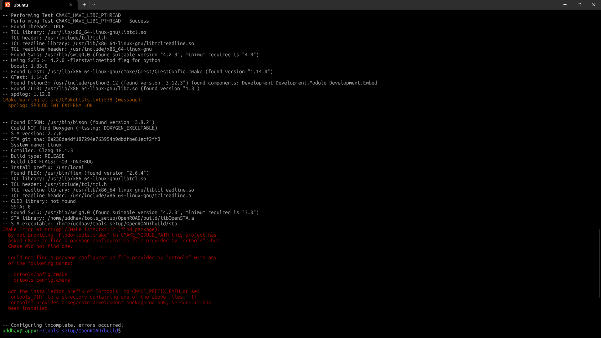

# Week 5 Notes

## Attempt 1: 

**Commands:**
```bash
git clone --recursive https://github.com/The-OpenROAD-Project/OpenROAD-flow-scripts
cd OpenROAD-flow-scripts

## setup 
sudo ./setup.sh

## build it
./build_openroad.sh --local

## verify
source ./env.sh
yosys -help  
openroad -help

## run it
cd flow
make

## GUI time
make gui_final
```

**Results:**
- Getting an error on the `sudo ./setup.sh`



```
uddhav@Lappy:~/vsd/OpenROAD-flow-scripts$ sudo ./setup.sh
[sudo] password for uddhav:
[INFO] Install ubuntu base packages using apt (-base or -all)
[INFO] Updating package lists...... ✖
Hit:1 https://download.docker.com/linux/ubuntu noble InRelease
Hit:3 http://archive.ubuntu.com/ubuntu noble InRelease
Hit:4 http://security.ubuntu.com/ubuntu noble-security InRelease
Hit:5 http://archive.ubuntu.com/ubuntu noble-updates InRelease
Hit:6 http://archive.ubuntu.com/ubuntu noble-backports InRelease
Ign:7 https://ppa.launchpadcontent.net/saltmakrell/ppa/ubuntu noble InRelease
Hit:2 https://apt.llvm.org/xenial llvm-toolchain-xenial-6.0 InRelease
Hit:8 https://ppa.launchpadcontent.net/ubuntu-toolchain-r/test/ubuntu noble InRelease
Err:9 https://ppa.launchpadcontent.net/saltmakrell/ppa/ubuntu noble Release
  404  Not Found [IP: 185.125.190.80 443]
Reading package lists...
E: The repository 'https://ppa.launchpadcontent.net/saltmakrell/ppa/ubuntu noble Release' does not have a Release file.
W: http://apt.llvm.org/xenial/dists/llvm-toolchain-xenial-6.0/InRelease: Key is stored in legacy trusted.gpg keyring (/etc/apt/trusted.gpg), see the DEPRECATION section in apt-key(8) for details.
[ERROR] Failed to execute: apt-get -y update
```

---

## Attmept 2: 

**Commands:**
```bash

## removing ppa thingy, coz its not letting me intall and maybe its not needer
sudo add-apt-repository --remove ppa:saltmakrell/ppa
sudo apt update
```

**Results:**



```
[INFO] Building and installing Lemon...... ✖
[  5%] Building CXX object lemon/CMakeFiles/lemon.dir/arg_parser.cc.o
[ 10%] Building CXX object lemon/CMakeFiles/lemon.dir/base.cc.o
[ 15%] Building CXX object lemon/CMakeFiles/lemon.dir/lp_skeleton.cc.o
[ 21%] Building CXX object lemon/CMakeFiles/lemon.dir/lp_base.cc.o
[ 26%] Building CXX object lemon/CMakeFiles/lemon.dir/random.cc.o
[ 31%] Building CXX object lemon/CMakeFiles/lemon.dir/color.cc.o
[ 36%] Building CXX object lemon/CMakeFiles/lemon.dir/bits/windows.cc.o
/tmp/DependencyInstaller-bCZSkW/lemon-graph/lemon/arg_parser.cc:224:20: warning: unused variable 's' [-Wunused-variable]
  224 |     Opts::iterator s = _opts.find(syn);
      |                    ^
In file included from /tmp/DependencyInstaller-bCZSkW/lemon-graph/lemon/random.cc:22:
/tmp/DependencyInstaller-bCZSkW/lemon-graph/lemon/random.h:252:9: error: ISO C++17 does not allow 'register' storage class specifier [-Wregister]
  252 |         register Word *curr = state + length - 1;
      |         ^~~~~~~~
/tmp/DependencyInstaller-bCZSkW/lemon-graph/lemon/random.h:253:9: error: ISO C++17 does not allow 'register' storage class specifier [-Wregister]
  253 |         register long num;
      |         ^~~~~~~~
2 errors generated.
gmake[2]: *** [lemon/CMakeFiles/lemon.dir/build.make:149: lemon/CMakeFiles/lemon.dir/random.cc.o] Error 1
gmake[2]: *** Waiting for unfinished jobs....
1 warning generated.
gmake[1]: *** [CMakeFiles/Makefile2:422: lemon/CMakeFiles/lemon.dir/all] Error 2
gmake: *** [Makefile:166: all] Error 2
[ERROR] Failed to execute: /home/uddhav/vsd/OpenROAD-flow-scripts/dependencies/bin/cmake --build build -j 8 --target install
```

**Notes:**
- 

---

## Attempt 3: 

**Commands:**
```bash
sudo apt install liblemon-dev
# Download and patch Lemon manually
cd /tmp
wget http://lemon.cs.elte.hu/pub/sources/lemon-1.3.1.tar.gz
tar -zxf lemon-1.3.1.tar.gz
cd lemon-1.3.1

# NOW you're in the right directory - patch it
sed -i 's/register //g' lemon/random.h

# Verify the patch worked
grep -n "register" lemon/random.h
# Should show NO results with "register Word" or "register long"

# Build with C++14 to be safe
mkdir build && cd build
cmake .. -DCMAKE_CXX_STANDARD=14
make -j$(nproc)
sudo make install

# Verify installation
ls /usr/local/include/lemon/  # Should show installed headers

# Now run OpenROAD build (will skip Lemon since it's installed)
cd /home/uddhav/vsd/OpenROAD-flow-scripts
./build_openroad.sh --local
```

**Results:**
- it showed same error again, meaning: these commands did nothing most likely. even tough i installed lemon locally, it shows its not installed and had to be installed again which gave same error.

---

## Attempt 4: 

**What I did:**
- installed openlane
- https://www.youtube.com/watch?v=gZtvArK3s08
- https://github.com/AnoushkaTripathi/Openlane_Installation_guide

**Results:**


---

## Attempt 5: 

**Commands:**

```bash
sudo apt install -y libgtest-dev cmake build-essential
sudo apt install libspdlog-dev
sudo apt install -y liblemon-dev


git clone https://github.com/google/or-tools.git
cd or-tools
mkdir build && cd build
cmake -DBUILD_DEPS=ON -DCMAKE_BUILD_TYPE=Release ..
make -j$(nproc)
sudo make install


git clone --recursive https://github.com/The-OpenROAD-Project/OpenROAD.git
cd OpenROAD/
sudo ./etc/DependencyInstaller.sh -base
mkdir build
cd build
cmake ..
```

**Result:**




**Conclusion:**

- openroad installation in openlane docker environment is succesfull.
- but a local installation of ORFS is not possible in ubuntu 24. should use ubuntu 22.

---
