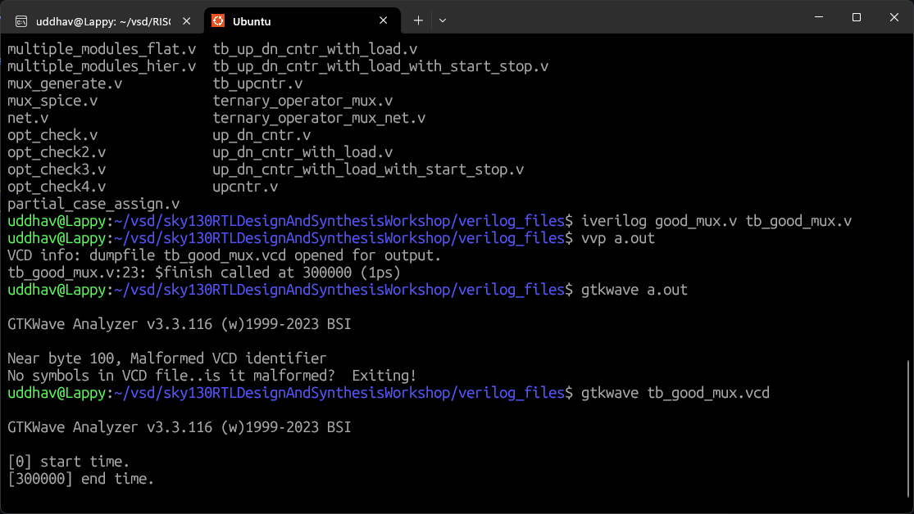
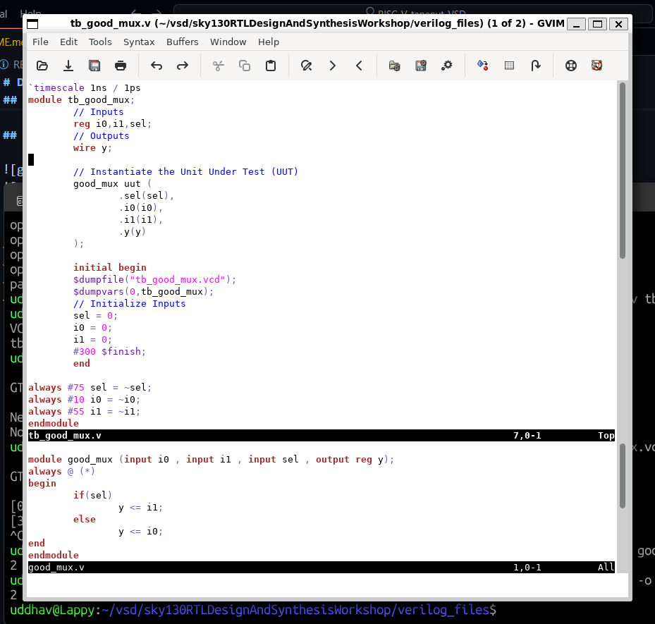
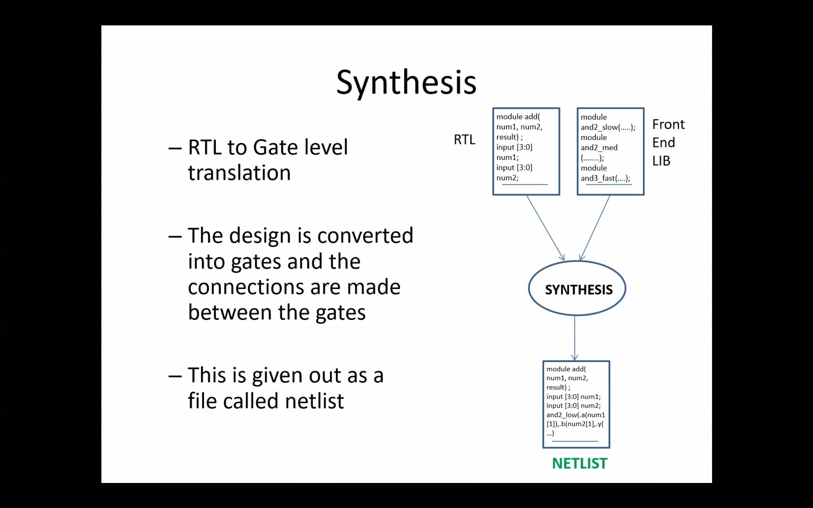
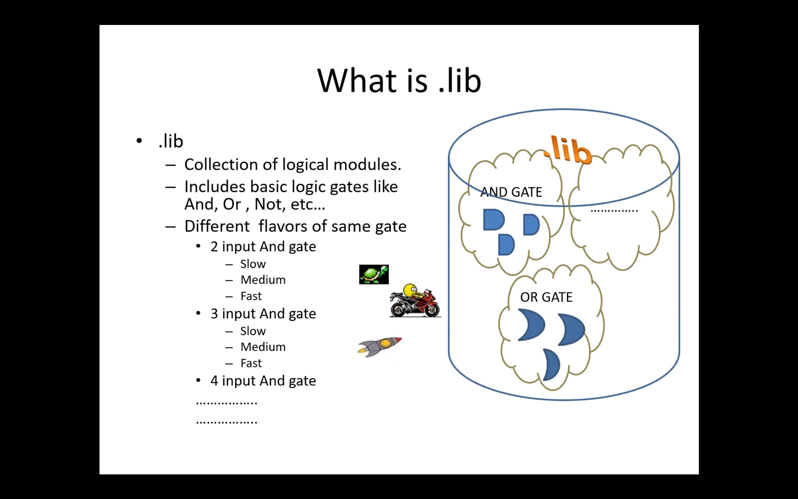
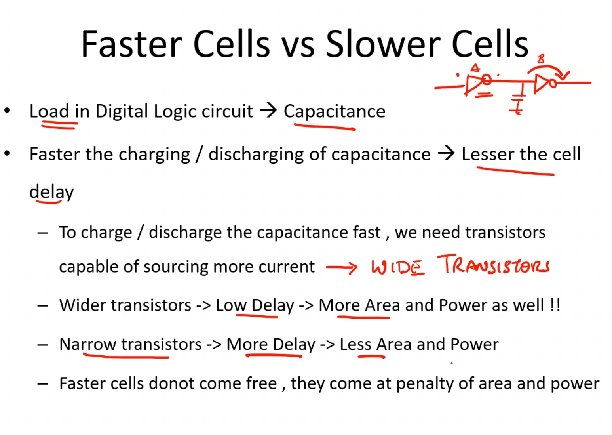
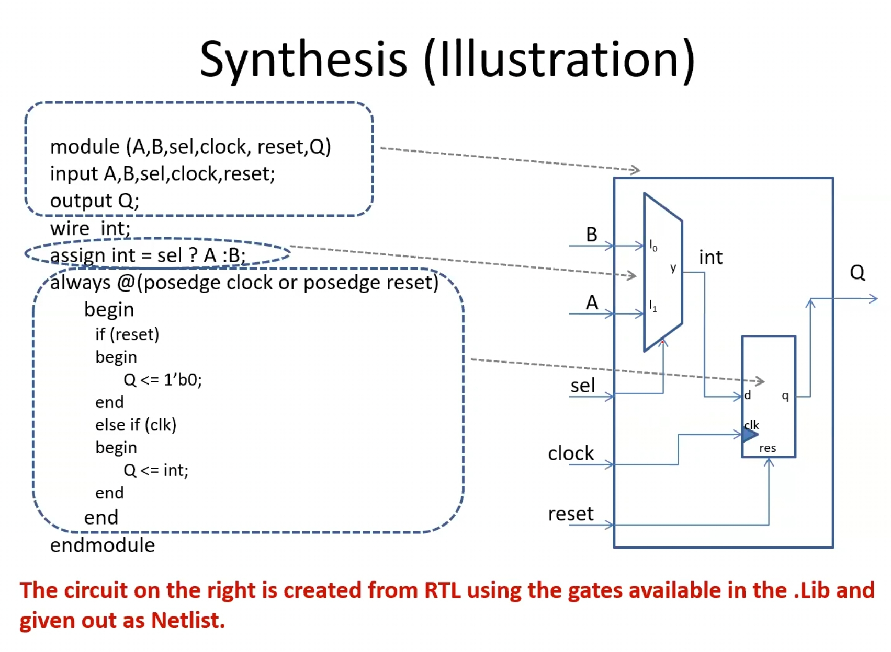

# Day 1

## 1. Introduction to iverilog

1. simulator is used for checking my design.
2. design: actual verilog code
3. testbench: setup to apply stimulus (test vectors) to design to check functionality

### Simulator:  

1. simulator is used for checking my design.
2. looks for changes on input signal
3. upon change in input, output is evaluated

### iverilog and gtkwave

iverilog takes in design + tb -> vcd file {value change dump file}

vcd file is analysed using gtkwave.

## 2. Labs using iverilog and gtkwave





```bash
gvim tb_good_mux.v -o good_mux.v
```



### 3. YOSYS

takes design and .lib file to generate netlist file.    
same testbench can be used for testing netlist generated.   





different flavours of gate is applied becuase of:   
a. setup time.  
b. hold time.   

we need fast cells for faster frequency and not violating setup timings.    
we need slow cells so we dont violate hold violations.  


   


## 4. Labs using YOSYS

```bash
yosys
```

```yosys
read_liberty -ignore_miss_func <.lib file> # here sky130_fd_sc_hd__tt_025C_1v80.lib
read_verilog <design.v>
synth -top <module name> # or submodule name 
abc -liberty <.lib file>
```


```misc
pwd
realpath
```

i installed yosys again using OSS CAD Suite

```bash
cd ~/tools_setup/
wget https://github.com/YosysHQ/oss-cad-suite-build/releases/download/2025-09-25/oss-cad-suite-linux-x64-20250925.tgz
tar -xzf [tab] # the cad suite file
echo 'source ~/tools_setup/oss-cad-suite/environment' >> ~/.bashrc # or add this line export PATH="$HOME/tools_setup/oss-cad-suite/bin:$PATH" to the .bashrc file 
source ~/.bashrc
yosys --version  # Should show 0.40+ from 2025
```
