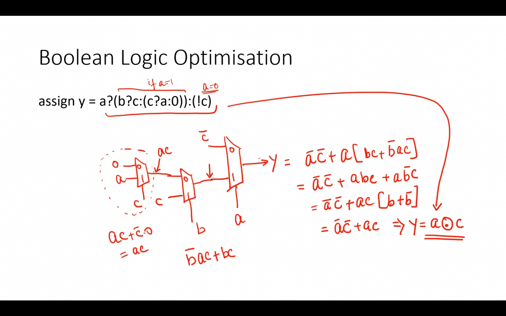
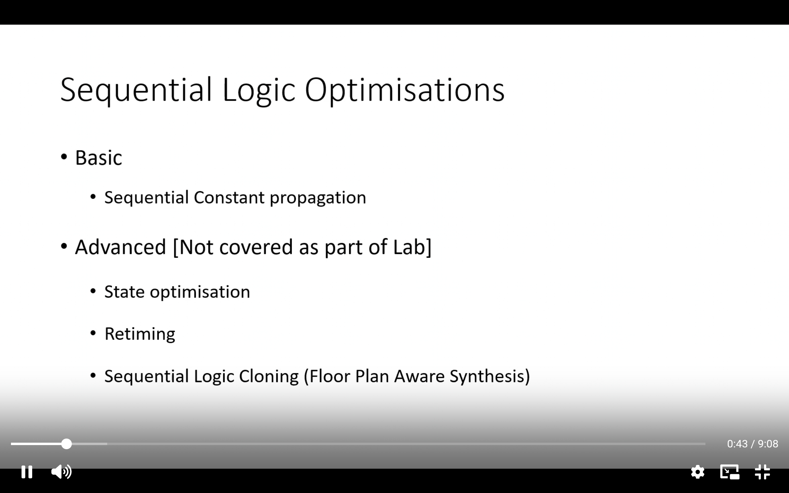
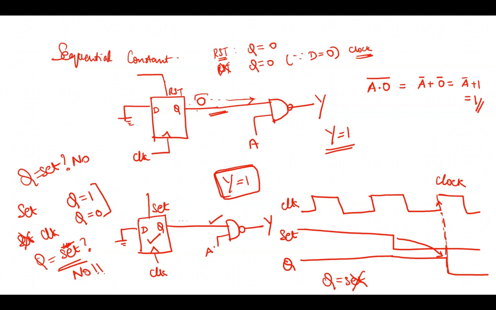
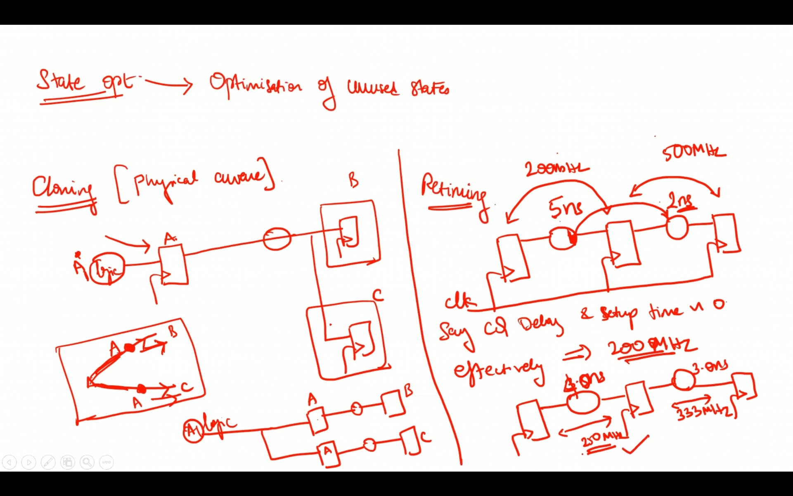
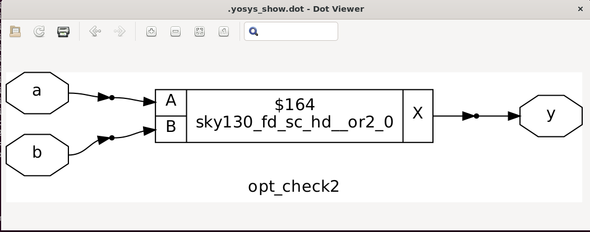
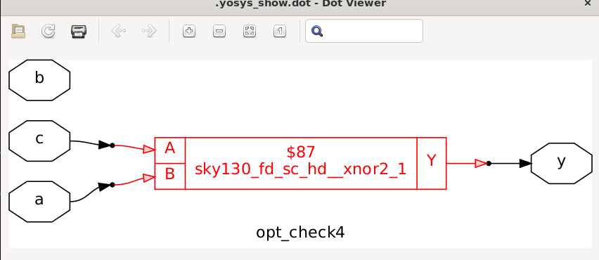
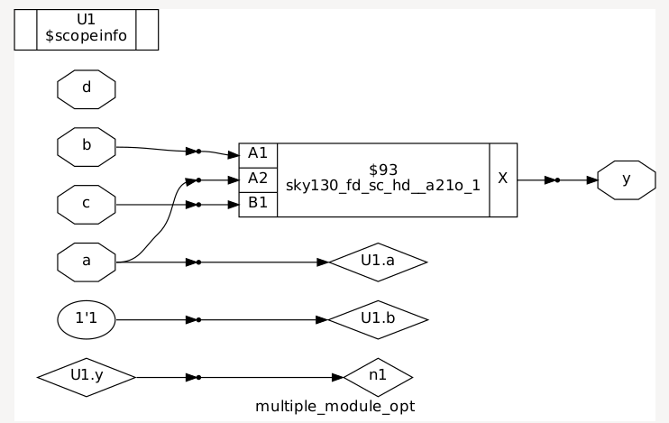
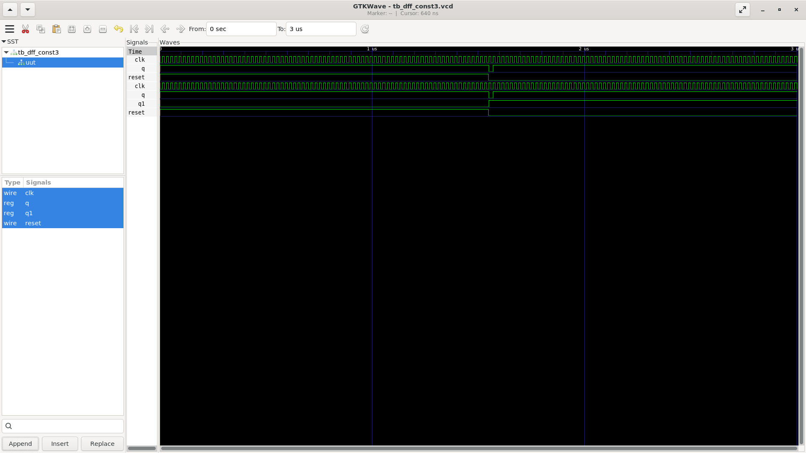

# Day 3 Optimizations:

## 1. Introduction to optimizations

Constant propogation, one of the imputs is set to be a value so complex terms can be simlplified to simple terms in some cases. 

boolean Logic Optimisation: 


Sequential Logic Optimisation:




1. State Optimisation: optimisation of unused states.
2. Cloning: Physical aware. if A FF is far from B and C. A is shifted closer to B and C with making single A FF into 2 FF if required.
3. Retinuing: one of the pipeline is limiting for fmax. split that pipe into 2 pipelines. or distribute to another flop.



## 2. Combinational logic optimizations

```yosys
read_liberty -lib ../lib/sky130_fd_sc_hd__tt_025C_1v80.lib
read_verilog opt_check.v
synth -top opt_check
opt_clean -purge
show
```



nand == input inverted or gate  

## 3. Sequential Logic Optimization





a



## 4. Sequential Logic Optimization for unused o/p

when msb is not required. niether for o/p nor for calculation.  
so a 3 bit counter which requires only Q\[0\] sees only 1 bit counter being synthesised.    
