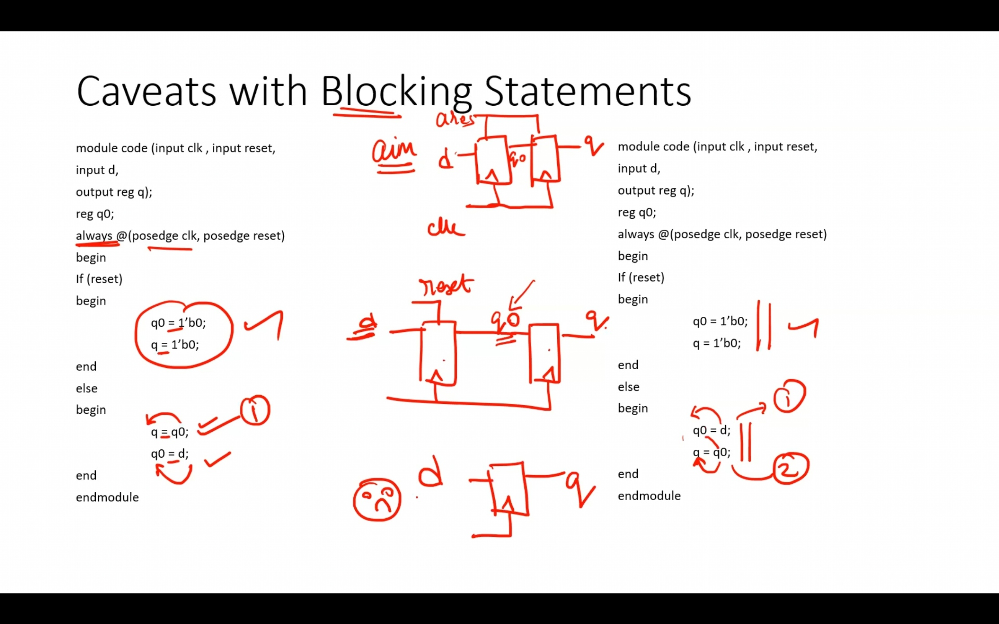
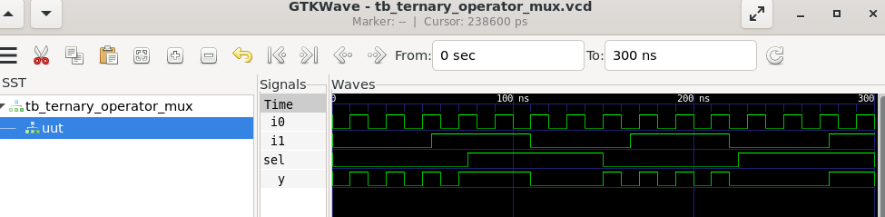
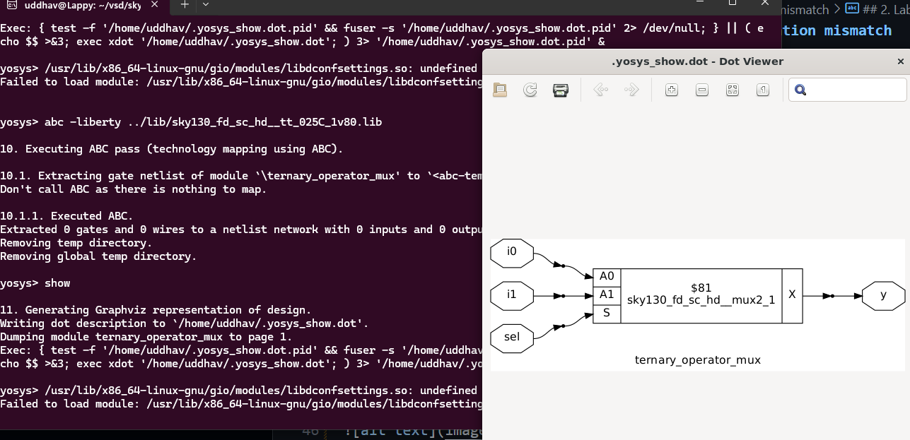
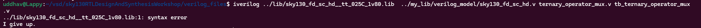
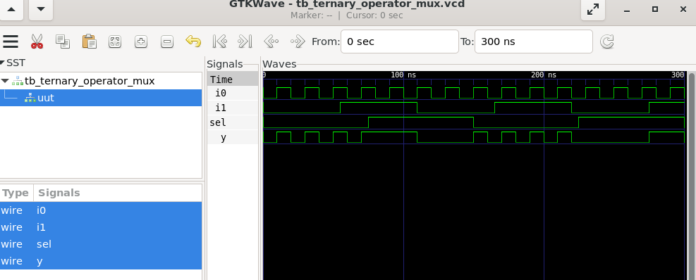

# Day 4 GLS, blocking/non-blocking, synthesis simulation mismatch

## 1. Theory

### GLS

1. Running the tb w/ netlist as dut.
2. Netlist is logically same as RTL code.
3. Verify logical corectness of design after synthesis.
4. Ensure the timing of design is met. // run it with delay annotation.

### GLS using iverilog

design + gate level verilog model + test bench => vcd file.  
vcd file analyzed using gtkwave.

### gate level verilog model

1. functionality for synthesis and simulation mismatch
2. timing aware.

#### Synthesis Simulation Mismatch

1. missing sensitivity list
2. Blocking vs non-blocking assignments.
3. Non standard verilog coding.

#### Missing sensitivity list

simulator works on activity -> only a change in i/p can change o/p. 
eg: in a mux if sensitivity list only has sel then it acts as latch. o/p evaluated only when sel changes.
    whereas if i1 changes it wont show unless sel also changes after that.  
when synthesis, it wont see sensitivity list.

#### Blocking and Non-blocking statements in verilog

Inside always block 
= Blocking, ex. in order    
<= Non-Blocking, ex. RHS when always block is entered, assigns to LHS. Parallel evaluation.

Caveats with Blocking Statement.    


## 2. Labs



```yosys
read_liberty -lib ../lib/sky130_fd_sc_hd__tt_025C_1v80.lib

```



```bash
iverilog ../lib/sky130_fd_sc_hd__tt_025C_1v80.lib  ../my_lib/verilog_model/sky130_fd_sc_hd.v ternary_operator_mux.v tb_ternary_operator_mux.v
```



```bash
# fixed it lol
 iverilog ../my_lib/verilog_model/primitives.v  ../my_lib/verilog_model/sky130_fd_sc_hd.v ternary_operator_mux.v tb_ternary_operator_mux.v
```



bad mux is giving flop behaviour due to synth sim mismatch.

## 3. 