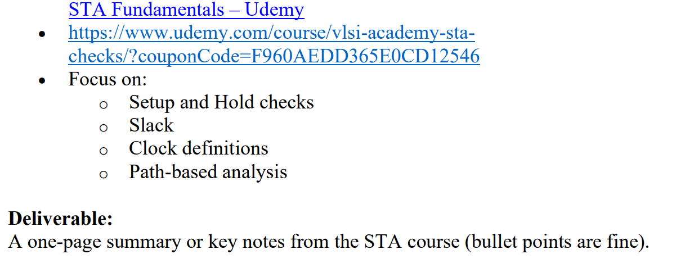

# 2. Fundamentals of STA

## 1. Setup and Hold checks

### setup time

time before which inputs should be stable. compared to edge of the clock.   
posedge or negedge depending on device

### hold time 

time after the clock edge for which the input should remain stable

### why

these are needed so as the output is defined since different gates take different time to propogate and process data the sequential flip flop.  
and this is done when clock edge arrives.

## 2. Slack

positive slack means no timing violations.  
negative slack means timing violation is most likely to occur.

for setup time
slack = AT - RT

for hold time
slack = RT - AT

## 3. Clock definitions

1. primary clock: main clock, defined at i/p port. 
2. generated clock: derived from primary clock. f/2 or so on...
3. Virtual Clock: imaginary clock not tied to any real pin. for I/O timing checks, used to set input delays relative to an external reference without complicating the actual clock tree.

## 4. Path-based analysis 

