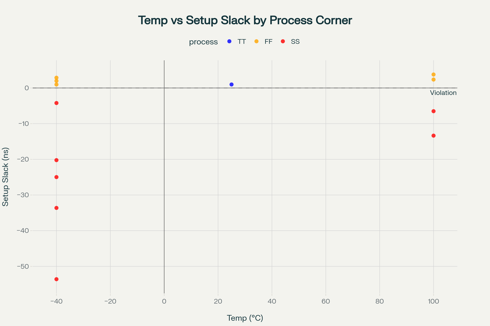
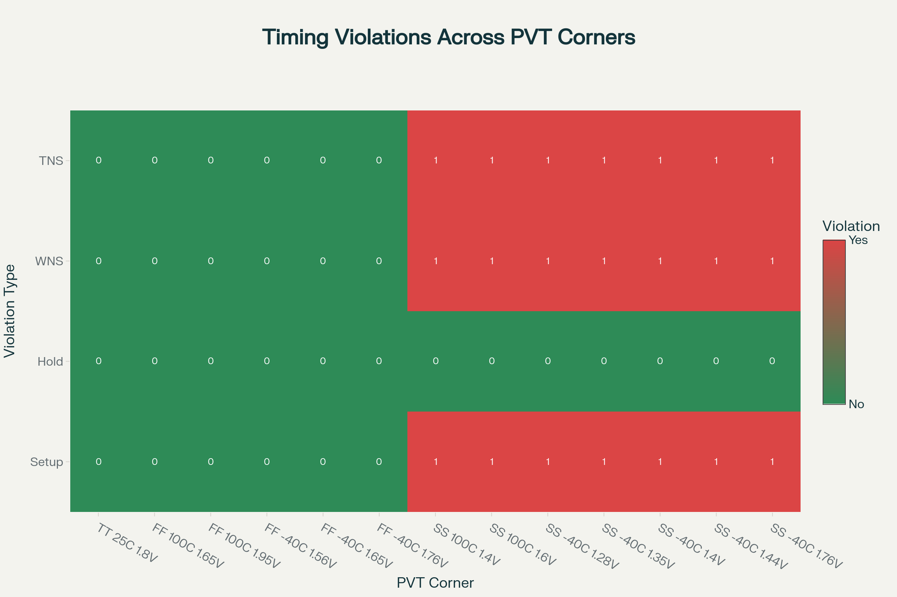
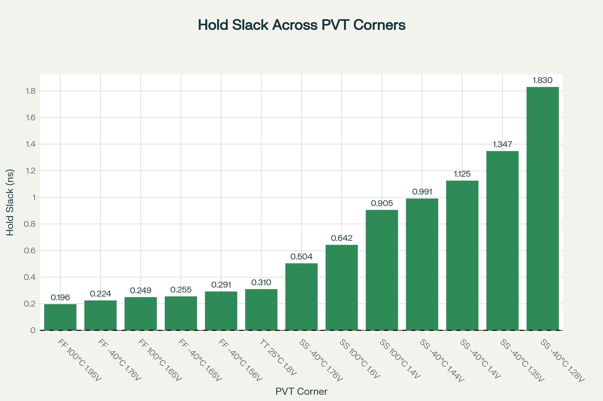
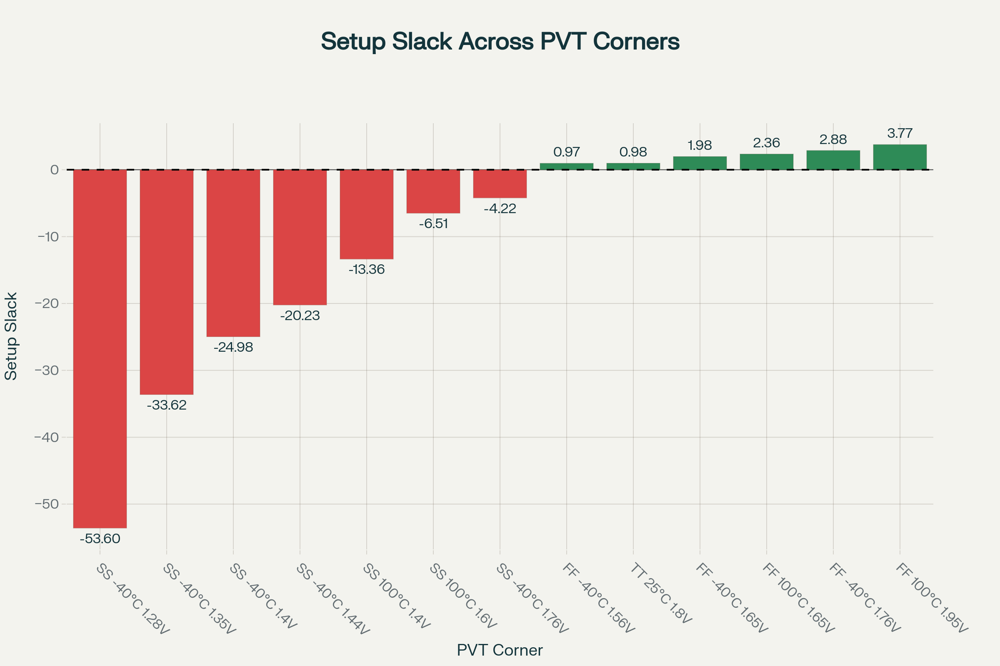
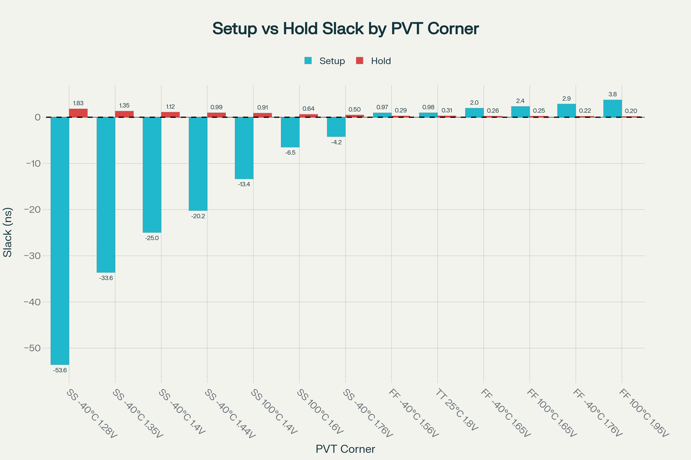

# OpenSTA

## Installing OpenSTA

<https://github.com/Ananya-KM/VSD_HDP/blob/main/Day7.md>

```bash
cd OpenSTA
docker build --file Dockerfile.ubuntu22.04 --tag opensta .
```

To run a docker container using the OpenSTA image, use the -v option to docker to mount direcories with data to use and -i to run interactively.

```bash
docker run -i -v $HOME:/data opensta
```

## next is the script

<https://github.com/arunkpv/vsd-hdp/blob/main/docs/Day_19.md>

The below tcl script sta_across_pvt.tcl can be run to performt the STA across the PVT corners for which the sky130 lib files are available

```tcl
 set list_of_lib_files(1) "sky130_fd_sc_hd__tt_025C_1v80.lib"
 set list_of_lib_files(2) "sky130_fd_sc_hd__ff_100C_1v65.lib"
 set list_of_lib_files(3) "sky130_fd_sc_hd__ff_100C_1v95.lib"
 set list_of_lib_files(4) "sky130_fd_sc_hd__ff_n40C_1v56.lib"
 set list_of_lib_files(5) "sky130_fd_sc_hd__ff_n40C_1v65.lib"
 set list_of_lib_files(6) "sky130_fd_sc_hd__ff_n40C_1v76.lib"
 set list_of_lib_files(7) "sky130_fd_sc_hd__ss_100C_1v40.lib"
 set list_of_lib_files(8) "sky130_fd_sc_hd__ss_100C_1v60.lib"
 set list_of_lib_files(9) "sky130_fd_sc_hd__ss_n40C_1v28.lib"
 set list_of_lib_files(10) "sky130_fd_sc_hd__ss_n40C_1v35.lib"
 set list_of_lib_files(11) "sky130_fd_sc_hd__ss_n40C_1v40.lib"
 set list_of_lib_files(12) "sky130_fd_sc_hd__ss_n40C_1v44.lib"
 set list_of_lib_files(13) "sky130_fd_sc_hd__ss_n40C_1v76.lib"

 read_liberty /data/vsd/VSDBabySoC/src/lib/avsdpll.lib
 read_liberty /data/vsd/VSDBabySoC/src/lib/avsddac.lib

 for {set i 1} {$i <= [array size list_of_lib_files]} {incr i} {
 read_liberty /data/vsd/skywater-pdk-libs-sky130_fd_sc_hd/timing/$list_of_lib_files($i)
 read_verilog /data/vsd/VSDBabySoC/output/post_synth_sim/vsdbabysoc.synth.v
 link_design vsdbabysoc
 current_design
 read_sdc /data/vsd/VSDBabySoC/src/sdc/vsdbabysoc_synthesis.sdc
 check_setup -verbose
 report_checks -path_delay min_max -fields {nets cap slew input_pins fanout} -digits {4} > /data/vsd/OpenSTA/examples/BabySOC/STA_OUPUT/min_max_$list_of_lib_files($i).txt

 exec echo "$list_of_lib_files($i)" >> /data/vsd/OpenSTA/examples/BabySOC/STA_OUPUT/sta_worst_max_slack.txt
 report_worst_slack -max -digits {4} >> /data/vsd/OpenSTA/examples/BabySOC/STA_OUPUT/sta_worst_max_slack.txt

 exec echo "$list_of_lib_files($i)" >> /data/vsd/OpenSTA/examples/BabySOC/STA_OUPUT/sta_worst_min_slack.txt
 report_worst_slack -min -digits {4} >> /data/vsd/OpenSTA/examples/BabySOC/STA_OUPUT/sta_worst_min_slack.txt

 exec echo "$list_of_lib_files($i)" >> /data/vsd/OpenSTA/examples/BabySOC/STA_OUPUT/sta_tns.txt
 report_tns -digits {4} >> /data/vsd/OpenSTA/examples/BabySOC/STA_OUPUT/sta_tns.txt

 exec echo "$list_of_lib_files($i)" >> /data/vsd/OpenSTA/examples/BabySOC/STA_OUPUT/sta_wns.txt
 report_wns -digits {4} >> /data/vsd/OpenSTA/examples/BabySOC/STA_OUPUT/sta_wns.txt
 }
```

## Results

| Process | Setup Slack (ns) |     |      | Hold Slack (ns) |     |      | WNS (ns) |     | TNS (ns) |     |
|---------|------------------|-----|------|-----------------|-----|------|----------|-----|----------|-----|
|         | min              | max | mean | min             | max | mean | min      | max | min      | max |
| FF      | 0.9674           | 3.7718 | 2.3914 | 0.196      | 0.2915 | 0.2432 | 0.0 | 0.0 | 0.0 | 0.0 |
| SS      | -53.5971         | -4.2197 | -22.3587 | 0.5038  | 1.8296 | 1.0491 | -53.5971 | -4.2197 | -37219.3945 | -1977.7168 |
| TT      | 0.9766           | 0.9766 | 0.9766 | 0.3096     | 0.3096 | 0.3096 | 0.0 | 0.0 | 0.0 | 0.0 |


    