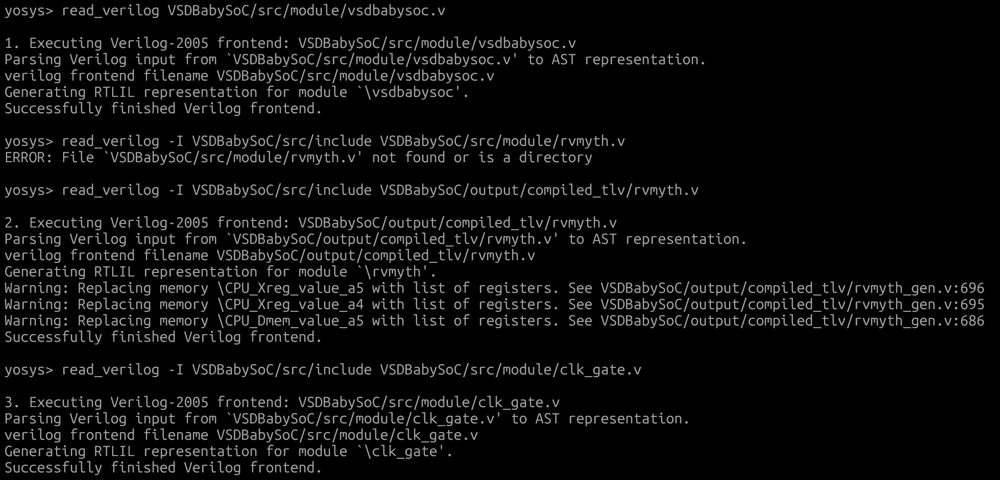
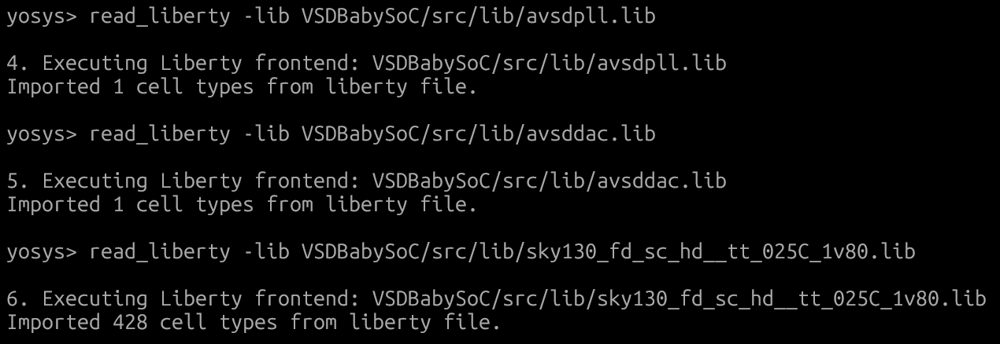
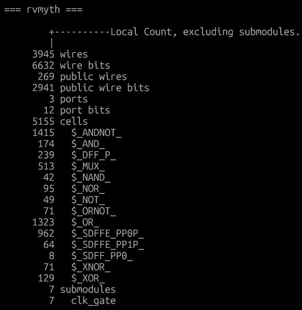
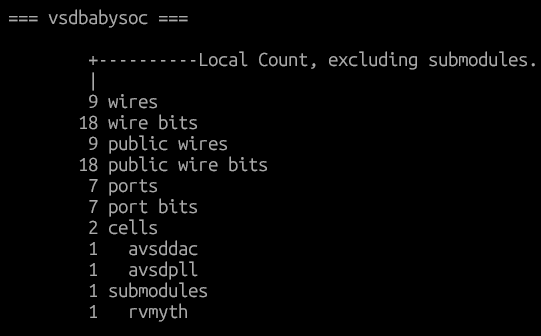
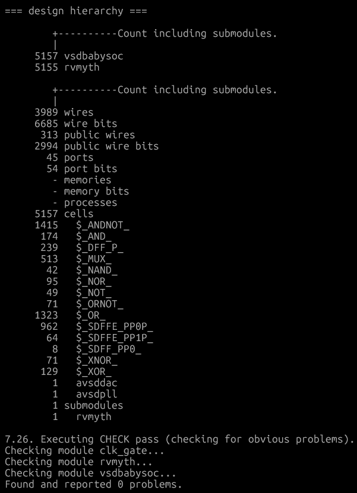

# Week 3

## 1. Post-Synthesis GLS

Objective

1. To understand and perform Gate-Level Simulation (GLS) after synthesis, validate functionality.
2. Intoduction to Static Timing Analysis (STA).
3. Use OpenSTA.

Steps:

1. Synthesis of the BabySoC design.
2. Run Gate-Level Simulation (GLS) using synthesized netlist.
3. Compare GLS output with functional simulation output (Week 2 task).

Deliverables:   
o Synthesis logs.   
o GLS waveform screenshots.  
o Short note confirming GLS = Functional outputs.   

Using this
<https://github.com/Ananya-KM/VSD_HDP/blob/main/Day%206.md>

### 1.1 GLS

-> used to verify functionality of design after synthesis.

1. GLS is performed using Standard Delay Format (SDF) files to ensure timing correctness.
2. validates that logic behaviour remains same and is free from, metastability or glitches.
3. iverilog ---> gtkwave
4. BabySoC consists of multiple modules like the RISC-V processor, PLL, and DAC. GLS ensures that these modules interact properly and meet the timing requirements in the synthesized design.

#### How To

```yosys
read_verilog VSDBabySoC/src/module/vsdbabysoc.v
read_verilog -I VSDBabySoC/src/include VSDBabySoC/output/compiled_tlv/rvmyth.v
read_verilog -I VSDBabySoC/src/include VSDBabySoC/src/module/clk_gate.v
```

~ 
Each -I \<path\> adds the given directory to the search path list that the Verilog frontend uses when it encounters an \includedirective duringread_verilog`.

Yosys then scans those directories—​in the order they were added—​to locate the referenced header or macro files before reporting “file not found”.

You can specify the switch multiple times to supply several search directories.
~



```yosys
read_liberty -lib VSDBabySoC/src/lib/avsdpll.lib
read_liberty -lib VSDBabySoC/src/lib/avsddac.lib
read_liberty -lib VSDBabySoC/src/lib/sky130_fd_sc_hd__tt_025C_1v80.lib
```



```yosys
synth -top vsdbabysoc
```








```yosys
dfflibmap -liberty VSDBabySoC/src/lib/sky130_fd_sc_hd__tt_025C_1v80.lib
```


```yosys
opt
abc -liberty VSDBabySoC/src/lib/sky130_fd_sc_hd__tt_025C_1v80.lib -script +strash;scorr;ifraig;retime;{D};strash;dch,-f;map,-M,1,{D}
```


```yosys
flatten
setundef -zero
clean -purge
rename -enumerate
```


```yosys
stat
```


```yosys
write_verilog -noattr VSDBabySoC/output/post_synth_sim/vsdbabysoc.synth.v
```


### Post Synthesis 

```bash
cp VSDBabySoC/src/gls_model/sky130_fd_sc_hd.v VSDBabySoC/src/module/sky130_fd_sc_hd.v
cp VSDBabySoC/output/post_synth_sim/vsdbabysoc.synth.v VSDBabySoC/src/module/vsdbabysoc.synth.v
```

```bash
iverilog -o VSDBabySoC/output/post_synth_sim/post_synth_sim.out -DPOST_SYNTH_SIM -DFUNCTIONAL -DUNIT_DELAY=#1 -I VSDBabySoC/src/include -I VSDBabySoC/src/module VSDBabySoC/src/module/testbench.v
```

```bash
cd VSDBabySoC/output/post_synth_sim/
./post_synth_sim.out
gtkwave post_synth_sim.vcd
```


q
